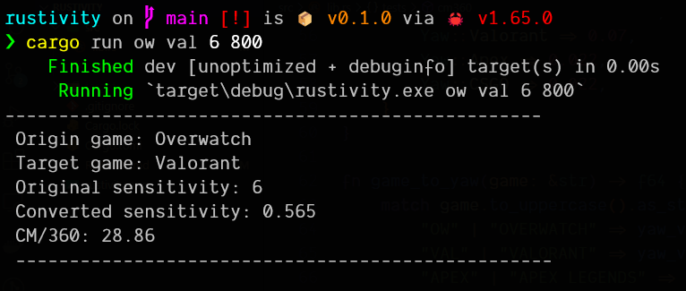

# Rustivity

A simple console application for converting sensitivity across games.

## How to use

1. Install Rust [Here](https://doc.rust-lang.org/book/ch01-01-installation.html).

2. Clone this repository.

3. Navigate to the local repository location.

4. `cargo run <origin game> <target game> <sensitivity> <DPI>`
   <br>
   _optional `<new DPI>` can be added to the end_
   <br>
   _view figure below for example_

5. Click heads with your newly converted sensitivity.

<hr>

Example figure:


<hr>

## Supported Games

```md
Valorant, Overwatch, CS:GO, Apex
```

## TODO

-   [x] Convert sensitivity across my favourite games
-   [x] Param options for DPI
-   [x] Calculate CM/360
-   [ ] Param options for FOV
-   [ ] Add more supported games and yaw values

## About

This is my first rust application, it's probably really bad but I've made this application out of my personal interests and mainly for practice purposes. If you plan on using it, I hope you enjoy it.
